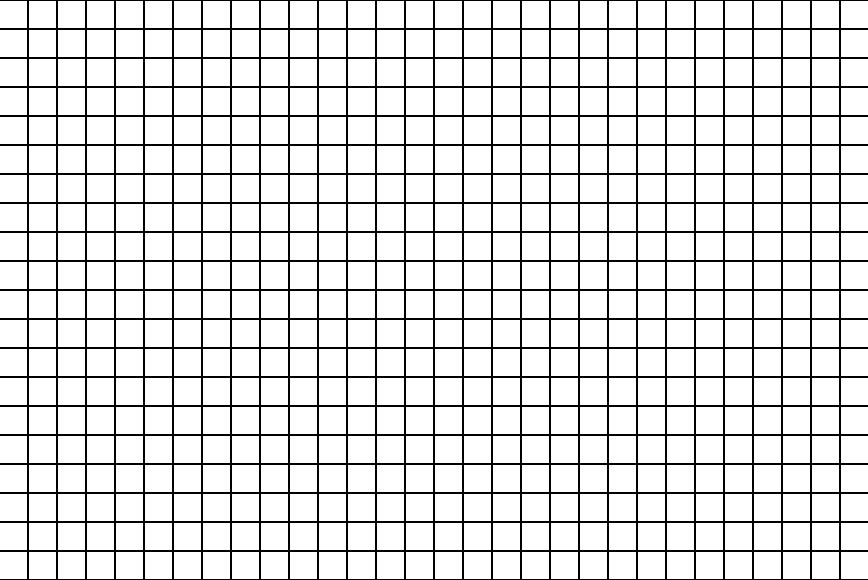
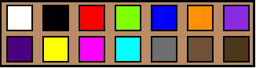
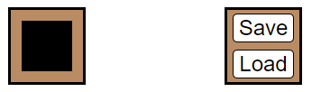

# PixelArtist

Simple web application where users can create pixel arts and save them on their browser.

# Technologies
  - VSCode
  - HTML
  - JavaScript (ES6)
  - SCSS

# Get the code

```
git clone https://github.com/shrimp16/PixelArtist.git
```

# Screenshots

<p align="center">
  
</p>

<p align="center">
  
</p>

<p align="center">
  
</p>
  
